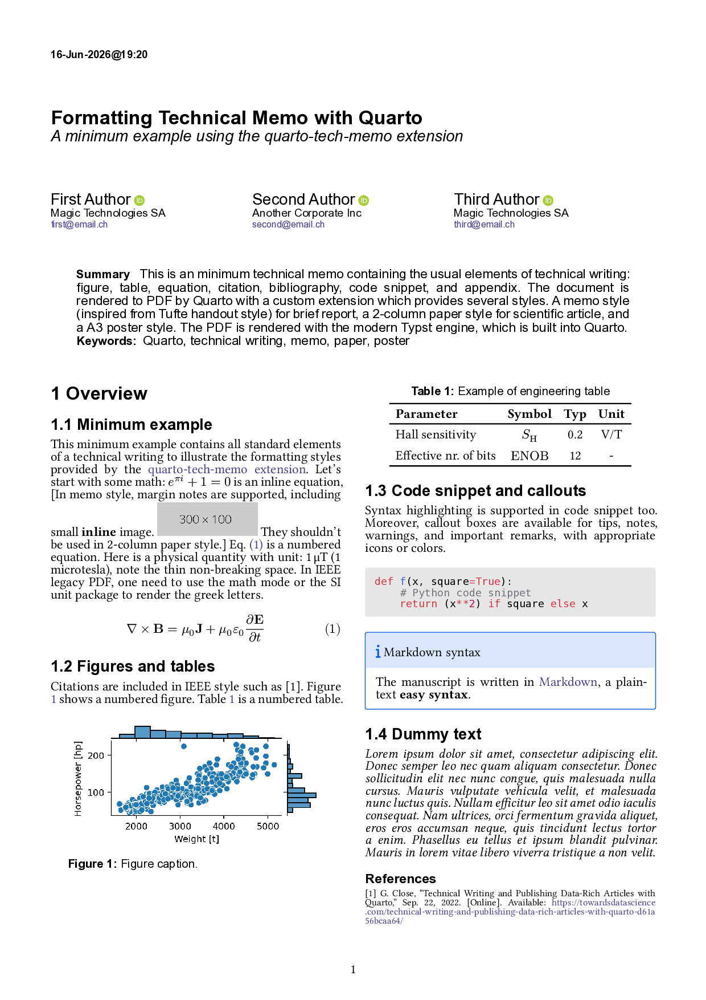
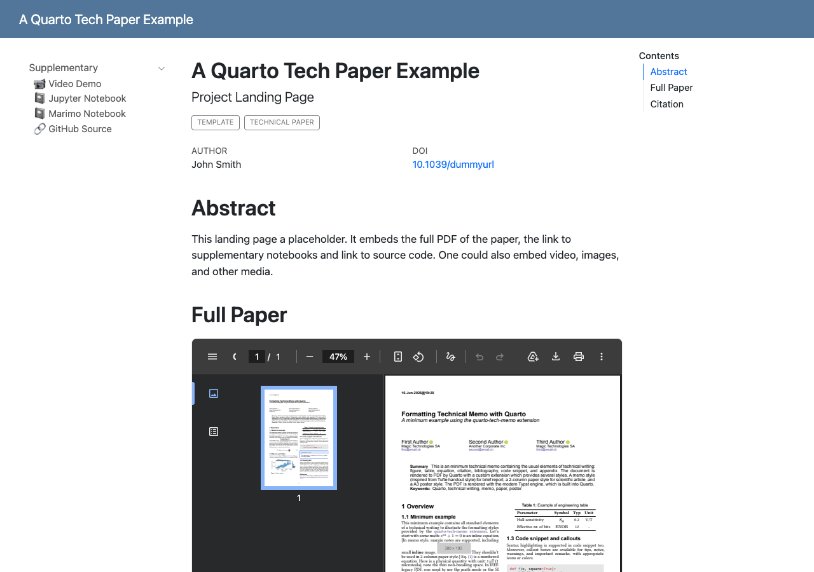

# Quarto Tech Paper

This repository contains the skeleton for a technical paper built
from computational Python notebooks, Python modular code, and markdown manuscript.
The manuscript is rendered in a well-formatted PDF by [Quarto](https://quarto.org/).
It is intended for technical papers (reports, preprints, ...) in engineering and science,
where data analysis and visualization is done in Python.

An example of a [generated PDF](dist/manuscript.pdf) file is included 
in the `dist/` folder.



> See [the companion medium article](https://medium.com/data-science-collective/turning-your-notes-into-pdf-technical-memos-or-data-science-reports-ddd150273cc6)
> for more background on the related Quarto Tech Memo, which serves as the template for the manuscript.


## Prior work

It is built upon two previous projects:

* [Cookiecutter Data Science](https://cookiecutter-data-science.drivendata.org/)
for the project structure and best practices for data science and scientific computing.
* [Quarto Tech Memo](https://github.com/gael-close/quarto-tech-memo)
for the report rendering as a well-formatted PDF tech memo or pre-print paper.


## Contents

The skeleton contains:

* Data and code and supplementary computational notebooks
* The needed dependencies to re-run in a proper python environment.
* The manuscript in simple Markdown syntax
* The data-intensive figures, which can be re-generated on demand. 
* Simple automation command(s) to render the paper and re-run the supplementary computational notebooks
(e.g. to update the figures when data or code has changed).
* A project landing page providing a single-page overview of the project that can be published as a website.

## Features 

* Directories organized similarly to [Cookiecutter Data Science](https://cookiecutter-data-science.drivendata.org/) that incorporate best practices for scientific computing.
* Proper git setup (git LFS, git ignore, ...)
* Paper manuscript in Quarto markdown with the ability to mix code, illustrations and narrative story in a lean syntax.
* Under the hood, the final formatting is handled by [Typst](https://typst.app/), 
a modern typesetting engine that is much easier and faster than Latex---this is [fully integrated in Quarto](https://quarto.org/docs/output-formats/typst.html).
* The Python dependencies are managed with [uv](https://docs.astral.sh/uv/) another modern and fast tool, which install dependencies on the fly in isolated reproducible environment
with one command.
* A `Taskfile.py` to invoke common task with [taskfile.dev](https://taskfile.dev/)

Generally speaking, the project is designed to be as lean and simple as possible
while following best practices for scientific computing and reproducible research.
The tools used are modern and fast. They work on all major platforms (Linux, MacOS, Windows).
[VS code](https://code.visualstudio.com/) extensions are available for Quarto/Typst/Markdown
for a smooth writing experience (auto-completion, live & sync preview, spell checking, AI assistance...).

| Legacy tool        | Modern tool     |
| ------------------ | --------------- |
| Latex syntax       | Markdown syntax |
| PdfLatex rendering | Typst           |
| venv, pip          | uv              |
| Makefile           | Taskfile        |

## Supplementary materials

The paper also includes supplementary materials in the form of computational notebooks.
These are exported as standalone HTML files to supplement the manuscript.
As an example, they are published on the repo Gitlab pages: <https://gael-close.github.io/quarto-tech-paper/contents.html>. 

The first notebook is a standard Jupyter notebook, and provides the source of the plot in the paper.
The second one is the [tutorial marimo notebook](https://marimo.io/).
See also [this article](https://towardsdatascience.com/why-im-making-the-switch-to-marimo-notebooks/)
for the motivation behind this new notebook format.


## Project landing page

The skeleton also provides a project landing page example
aggregating the project materials in a single page to be published online.
Here is the included example: <https://gael-close.github.io/quarto-tech-paper>.




It is also rendered by Quarto for consistency.
Other (non quarto) templates are available at: 
<https://github.com/eliahuhorwitz/Academic-project-page-template>


## Getting started

Install [uv](https://docs.astral.sh/uv/getting-started/installation/) 
and [taskfile.dev](https://taskfile.dev/docs/installation) 
as described in their documentation. 

Then run the following to install the project dependencies,
and instantiate the project template.

```bash
# Get the template
uvx cookiecutter gh:gael-close/quarto-tech-paper
cd new-dir
```
Then run the required task (see `tasks list`) and the README in the instantiated project folder.

```bash
task install
task render
...
```


## Optional files

A few optional recommended git config files are available in the `optional/` folder.
To enable them, move them in the root folder.


## Development

To run a complete test suite to check that everything is working as expected.

```bash

task setup basic-test render-all
# Check 
open new-dir/dist/contents.html

# Once all tests pass, save the example
task save-example
open dist/contents.html # should be the same as above
```


