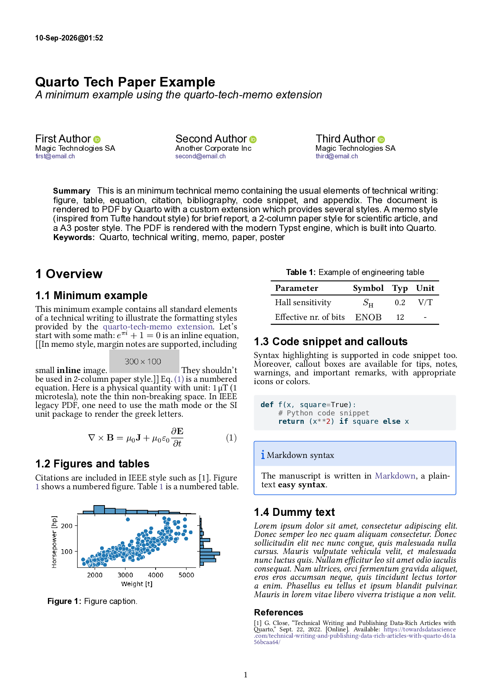
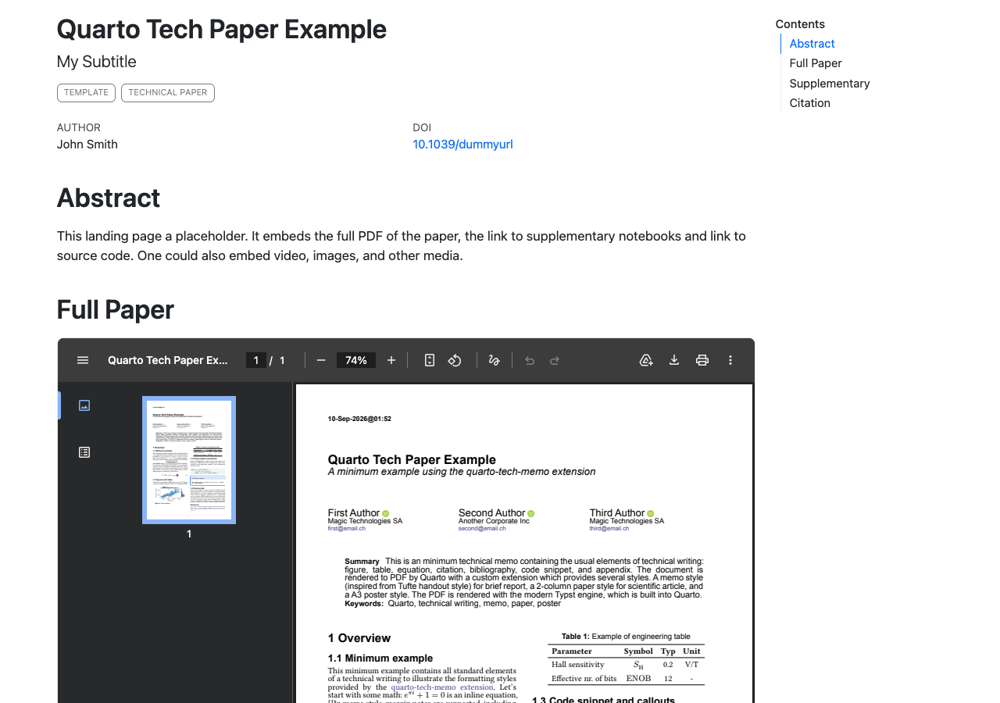

# Quarto Tech Paper

This repository contains the skeleton for a technical paper built
from computational Python notebooks, Python modular code, and markdown manuscript.
The manuscript is rendered in a well-formatted PDF by [Quarto](https://quarto.org/).
It is intended for technical papers (reports, preprints, ...) in engineering and science,
where data analysis and visualization is done in Python.

**Quarto** is used to render the paper as PDF, and the support materials (mostly Python notebooks) as HTML.
A project landing page, which can be published online as a single entry point, is also generated based on <https://gael-close.github.io/quarto-tech-paper/>.

An example of a [generated PDF](public/Quarto%20Tech%20Paper%20Example.pdf) file is included 
in the `public/` folder.



> See [the companion medium article](https://medium.com/data-science-collective/turning-your-notes-into-pdf-technical-memos-or-data-science-reports-ddd150273cc6)
> for more background on the related Quarto Tech Memo, which serves as the template for the manuscript.

## TL;DR

Assuming you have [pixi](https://pixi.sh/latest/#installation) installed.
Navigate to a new folder where you want to download the template, 
then download the template, install dependencies, and render the paper to PDF with:

**Linux/macOS/Git Bash[^1]:**
```bash
<<<<<<< HEAD
curl -fsSL https://raw.githubusercontent.com/gael-close/quarto-tech-paper/HEAD/download-template.sh | bash
cd paper
pixi install
pixi run render-paper
=======
curl -fsSL https://raw.githubusercontent.com/gael-close/quarto-tech-paper/HEAD/init.sh | bash
pixi run render
```

**Windows PowerShell:**
```powershell
iex (iwr https://raw.githubusercontent.com/gael-close/quarto-tech-paper/HEAD/init.ps1).Content
pixi run render
>>>>>>> 7cfc334 (Clean up README with pixi)
```

See the [full documentation](#details-on-getting-started) for more details.

## Prior work

It is built upon:

* [Quarto Tech Memo](https://github.com/gael-close/quarto-tech-memo)
for the report rendering as a well-formatted PDF tech memo or pre-print paper.

* [Cookiecutter Data Science](https://cookiecutter-data-science.drivendata.org/)
for the general project structure and best practices for data science and scientific computing. The paper is a special case of this recommended structure.

## Contents

The skeleton contains:

* Data and code and supplementary computational notebooks
* The needed dependencies to re-run in a proper python environment.
* The manuscript in simple Markdown syntax
* The data-intensive figures, which can be re-generated on demand. 
* Simple automation command(s) to render the paper and re-run the supplementary computational notebooks
(e.g. to update the figures when data or code has changed).
* A project landing page providing a single-page overview of the project that can be published as a website.

## Features 

* Directories organized similarly to [Cookiecutter Data Science](https://cookiecutter-data-science.drivendata.org/) that incorporate best practices for scientific computing.
* Proper git setup (git LFS, git ignore, ...)
* Paper manuscript in Quarto markdown with the ability to mix code, illustrations and narrative story in a lean syntax.
* Under the hood, the final formatting is handled by [Typst](https://typst.app/), 
a modern typesetting engine that is much easier and faster than Latex---this is [fully integrated in Quarto](https://quarto.org/docs/output-formats/typst.html).
* The Python dependencies are managed with [uv](https://docs.astral.sh/uv/) another modern and fast tool, which install dependencies on the fly in isolated reproducible environment
with one command.
* A `Taskfile.py` to invoke common task with [taskfile.dev](https://taskfile.dev/)

Generally speaking, the project is designed to be as lean and simple as possible
while following best practices for scientific computing and reproducible research.
The tools used are modern and fast. They work on all major platforms (Linux, MacOS, Windows).
[VS code](https://code.visualstudio.com/) extensions are available for Quarto/Typst/Markdown
for a smooth writing experience (auto-completion, live & sync preview, spell checking, AI assistance...).

| Legacy tool        | Modern tool     |
| ------------------ | --------------- |
| Latex syntax       | Markdown syntax |
| PdfLatex rendering | Typst           |
| venv, pip          | pixi            |
| Makefile           | pixi tasks      |

[pixi](https://pixi.sh/) is a modern and fast tool to manage Python dependencies (with its own built-in `uv`) and environments (including non-Python dependencies).
It can also runs project tasks (e.g. `pixi run render-paper` to render the paper in a cross-platform way).

## Supplementary materials

The paper also includes supplementary materials in the form of computational notebooks.
These are exported as standalone HTML files to supplement the manuscript.
As an example, they are published on the repo Gitlab pages: <https://gael-close.github.io/quarto-tech-paper/contents.html>. 

The first notebook is a standard Jupyter notebook, and provides the source of the plot in the paper.
The second one is the [tutorial marimo notebook](https://marimo.io/).
See also [this article](https://towardsdatascience.com/why-im-making-the-switch-to-marimo-notebooks/)
for the motivation behind this new notebook format.

## Project landing page

The skeleton also provides a project landing page example
aggregating the project materials in a single page to be published online.
Here is the included example: <https://gael-close.github.io/quarto-tech-paper>.



It is also rendered by Quarto for consistency.
Other (non quarto) templates are available at: 
<https://github.com/eliahuhorwitz/Academic-project-page-template>


## Additional tasks

All pixi tasks are cross-platform and can be run on Linux, macOS, and Windows.

**Optional**

```bash
<<<<<<< HEAD
#1. Drop in bash (from windows Powershell)
bash

# 2. Download the template
curl -fsSL https://raw.githubusercontent.com/gael-close/quarto-tech-paper/HEAD/download-template.sh | bash

cd paper
```

**Install all dependencies:**

```bash
# Install ALL dependencies (conda packages + Python packages + local package)
pixi install

# Optional checks
pixi info                  # View environment info
pixi list                  # List installed packages
pixi run check-import      # Verify local package is importable
pixi run pytest -s         # Run tests
=======
pixi list
pixi run check-import
pixi run pytest -s
>>>>>>> 7cfc334 (Clean up README with pixi)
```

**Configuration**

Edit two places with your paper title and credentials:

1. `pyproject.toml` — sets `SHORT_TITLE` for all pixi tasks:
```toml
[tool.pixi.activation.env]
SHORT_TITLE = "My Paper Title"
```

2. `.env` — secrets and publishing settings (copy from `.env.example`):
```bash
cp .env.example .env
# then edit:
#   GOOGLE_FID     – Google Drive folder ID
#   RCLONE_DRIVE_TOKEN – rclone OAuth token (see Publishing section)
```

Then apply the title to the source files:
```bash
pixi run setup
```

**Discover available tasks:**

Then run the required task (see `tasks list`).

```bash
pixi task list        # List all available tasks
pixi task info <task> # Show details for a specific task
```

> Prefix all standard CLI commands with `pixi run`,
> or load the environment once with `pixi shell`.
> Named tasks must always be called with `pixi run <task>`.

**Common workflows:**

```bash
# Render paper to PDF
pixi run render-paper

<<<<<<< HEAD
# Execute and convert notebooks to HTML
NB=01-notebook.ipynb pixi run notebook
NB=02-notebook.py pixi run notebook-marimo
# on Windows: env:NB="01-notebook.ipynb"; pixi run notebook
=======
# Process all notebooks
pixi run notebook

# Or run the script directly with custom notebooks
python scripts/notebook.py 01-notebook.ipynb 02-notebook.py --exec
>>>>>>> 7cfc334 (Clean up README with pixi)

# Build distribution website
pixi run render-site
```

**Python development:**

Start a shell with `pixi shell` and run Python commands in the environment.

```bash
plots plot-sine --freqency 1
jupyter lab      # Open Jupyter
```

The package (`my_package`) under development is installed in editable mode, 
so changes take effect immediately.

Import the package in a Python script as follows: 

```python
from my_package.config import RAW_DATA_DIR
from my_package.dataset import load_data
df = load_data(RAW_DATA_DIR / "dataset.csv")
...
```

## Publishing to Google Drive

Set `GOOGLE_FID` (Drive folder ID) and `RCLONE_DRIVE_TOKEN` in `.env`.
To obtain a token:

```bash
rclone authorize "drive"
# Copy the printed JSON into RCLONE_DRIVE_TOKEN in .env
```

Then upload the PDF to Google Drive with:

```bash
pixi run pub-gdrive
```


## Development

To develop, as opposed to use, the template itself,
install[taskfile.dev](https://taskfile.dev/docs/installation).

To run a complete test suite to check that everything is working as expected.

```bash
task setup render-all save-example
# Check manually
open public/contents.html
```

You can also download the template directly into another folder for testing:
```bash
rm -rf ~/Downloads/paper/* 2>/dev/null
mkdir -p ~/Downloads/paper && cd $_
bash /Users/gcl/MyData/Work/MLX/Box_4/quarto-tech-paper/init.sh
```

[^1]: On Windows, Git includes built-in Git Bash which provides the bash shell required to run the download script and commands. 

